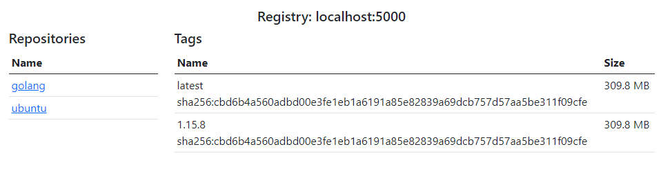

# registry-ui

Simple docker registry ui written with https://github.com/google/go-containerregistry

### Run with docker

`docker run -p 80:80 galetis/registry-ui -url "localhost:5000"`

### Run standalone

``./registry-ui -url localhost:5000``

### Params
```
-pass string
Password for registry auth
-port int
Http listener port (default 80)
-url string
Url for registry endpoint (default "localhost:5000")
-user string
Username for registry auth
```


